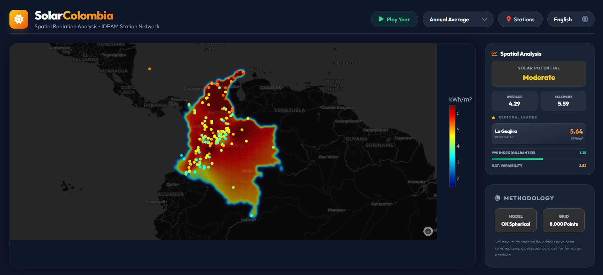

# ☀️ Solar Colombia | Dashboard de Radiación

## 📌 Descripción
**Solar Colombia** es una plataforma interactiva de análisis geoespacial diseñada para visualizar y analizar el potencial de radiación solar en el territorio colombiano. Utilizando datos históricos de la red de estaciones del **IDEAM**, el proyecto aplica algoritmos de interpolación avanzada (**Kriging**) para generar superficies de radiación continua, permitiendo identificar las zonas con mayor aptitud para proyectos de energía fotovoltaica.

## 🚀 Características Principales
- **Mapa de Calor Interactivo**: Visualización dinámica de la radiación solar (kWh/m²) en todo el país.
- **Interpolación Kriging**: Modelo matemático (Ordinary Kriging - Esférico) aplicado sobre 8,000 puntos para una precisión territorial superior.
- **Soporte Multi-idioma**: Interfaz disponible en **Inglés**, **Español** y **Alemán**.
- **Modo Animación**: Reproducción automática de la variabilidad solar a lo largo de los meses del año.
- **Panel de KPIs Geográficos**:
  - **Potencial Solar**: Clasificación automática (Excelente, Alto, Moderado, Bajo).
  - **Índice P90**: Garantía de radiación superada por el 90% del territorio.
  - **Líder Regional**: Identificación dinámica del departamento con mayores niveles de radiación.
- **Diseño Premium**: Interfaz moderna en modo oscuro con efectos de desenfoque (Glassmorphism) y diseño responsivo.

## 🛠️ Stack Tecnológico
### Frontend
- **HTML5 / JavaScript (ES6+)**
- **Tailwind CSS**: Estilizado moderno basado en utilidades.
- **Plotly.js**: Motor de renderizado para el mapa base (Mapbox) y visualización de datos espaciales.
- **FontAwesome**: Iconografía técnica.
- **Internacionalización (i18n)**: Implementación nativa para cambio dinámico de idioma.

### Análisis Geoestadístico & Backend
- **Python**: Procesamiento de datos y modelado geoespacial.
- **PyKrige**: Implementación del modelo Ordinary Kriging.
- **GeoPandas & Shapely**: Procesamiento de geometrías y máscaras geográficas nacionales.
- **Pandas & NumPy**: Manipulación eficiente de grandes volúmenes de datos meteorológicos.

## 📂 Estructura del Proyecto
- `index.html`: Dashboard principal con soporte multi-idioma y lógica de visualización.
- `kriging_interpolation.py`: Script de Python para procesar datos CSV y generar la malla interpolada.
- `radiation_data.csv`: Datos de estaciones (Radiación mensual y promedio anual).
- `colombia.json`: GeoJSON del límite nacional para el recorte de la interpolación.
- `kriging_data.json`: Resultados de interpolación procesados para el consumo del dashboard.
- `convert_units.py`: Utilidad para normalización de unidades (Wh/m² a kWh/m²).

## 📊 Metodología
La superficie de radiación se genera mediante **Kriging Ordinario**, un método geoestadístico que estima valores en puntos no muestreados basándose en la correlación espacial de los datos conocidos (estaciones).
1. **Limpieza**: Se procesan los datos del IDEAM eliminando valores nulos y normalizando coordenadas.
2. **Interpolación**: Se ejecuta el modelo esférico para cada mes del año.
3. **Máscara**: Los resultados se filtran utilizando el polígono oficial de Colombia para evitar distorsiones en zonas fronterizas y oceánicas.

## ⚙️ Instalación y Uso Local
1. Clona el repositorio.
2. Abre `index.html` en un navegador (se recomienda usar un servidor local como *Live Server* de VS Code para cargar archivos JSON correctamente).
3. Para actualizar los datos:
   - Instala las dependencias de Python: `pip install pandas numpy pykrige geopandas shapely`
   - Ejecuta `python kriging_interpolation.py` para regenerar la malla de datos.

---
*Desarrollado para el análisis de energías renovables en Colombia.*
